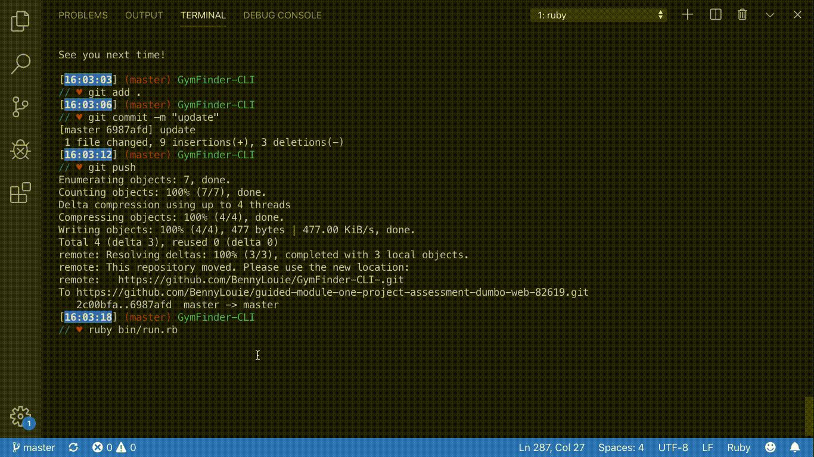

GYMFINDER CLI APP
========================

A database search application that allows users to create and manage an account, search for available gyms and programs as well as register for gyms.

The app features an animated welcome display as well as a password required login.
Including deeply navigatable menus and choice options, users have the ability to customize their membership status as well as update their user information.

The application is also pre-seeded with a list of bogus gyms and user information.

This app was developed as Flatiron School’s mod1 group project to demonstrate the knowledge of Active Record Associations, as well as CRUD methods, and database management.

---

HOW TO GET STARTED
========================

1) Clone this repository into your computer.

2) Using your terminal, CD into the directory holding this repository.

3) `bundle install` the gems required to load this app.

4) Run `rake db:migrate` to create the necessary database tables.

5) `rake db:seed` to load dummy data.

6) Run `ruby bin/run.rb` to load the app.

---

HOW TO USE THE APP
========================

1) Upon launching the application, user will be prompted to either login for a returning user or create a new user account.

2) For first time users, follow the instruction after selecting `New User`.

3) After an account has been created, user will be directed into a main menu page.

4) Through the `My Gyms` selection, users will be allowed to browse their current list of registered gyms as well as the programs available for each respective gym.

5) Through the `Manage Memberships` selection, users will be able to see a list of their active and inactive memberships as well as update their membership status. If a membership is "active", updating it will change it to "inactive" and vice versa. Users may also cancel their membership completely as well as register new memberships from a list of available gyms.

6) Through the `Manage Account` selection, users may edit their account information such as "username", "name", "city", and "state". At the top of the display will be the user's current information. It is also in this page where users may delete their account.

7) Through the `Search Gyms` selection, users may search for a gym by name, program, or location. 

  - Searching through name allows the user to type in a gym's name and returns a list of all gym's whose name includes what you type in.

  - Searching through program brings the user to a page with the option to search by either program name or program category. Both will give a list of names and categories respectively. Once an item on a list is selected, the gym(s) containing the selected program as well as a program description will be displayed.

  - Searching through location brings the user to a page with the option to search by either city or state. Both gives a list of either cities or states. Once a city/state is selected, a list of gyms located in that location will be displayed.

8) The `Exit` selection exits the app. Duh! 

CREATORS
========================

Benny: https://github.com/BennyLouie

Dan: https://github.com/dangrammer

========================
